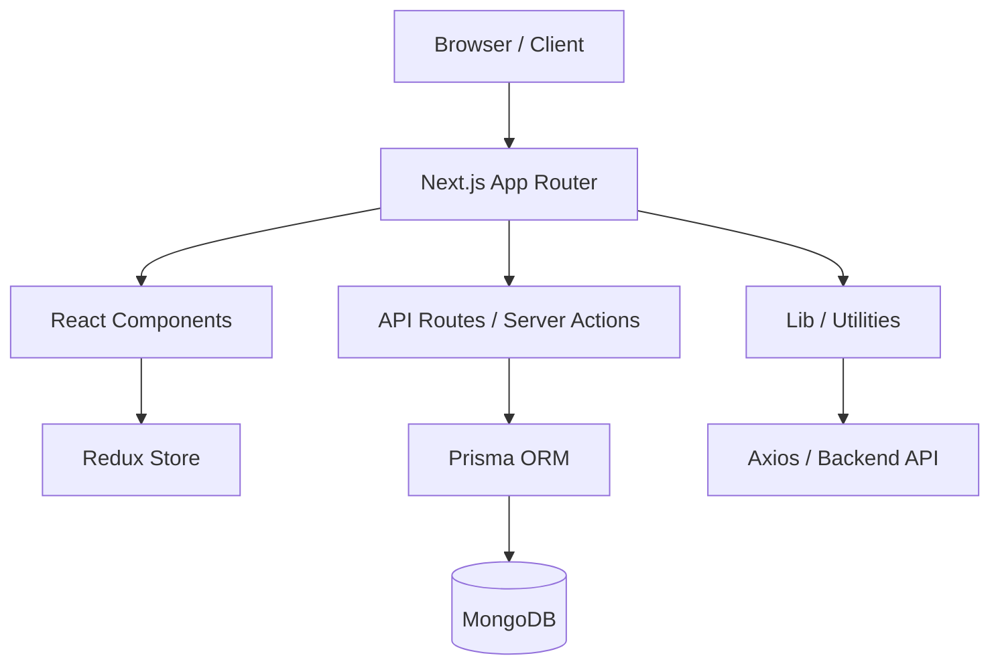

# 🏗 High-Level Architecture

The project is a Next.js 15 application using the App Router, integrated with a MongoDB database via Prisma. It follows a modular structure where UI components are decoupled from business logic and state.

## 📂 Core Directory Breakdown

| Directory | Purpose | Key Contents |
| :--- | :--- | :--- |
| `app/` | Routing and Layouts | `(auth)`, `(dashboard)`, `admin`, `api` |
| `components/` | Reusable UI Elements | `landing`, `dashboard`, `ui`, `workspace` |
| `lib/` | Core Logic & Shared Utils | `api-client.ts`, `crypto.ts`, `github.ts` |
| `store/` | Global State Management | `slices/`, `store.ts`, `provider.tsx` |
| `prisma/` | Data Modeling | `schema.prisma`, `seed.ts` |
| `types/` | TypeScript Definitions | Shared interfaces and types |
